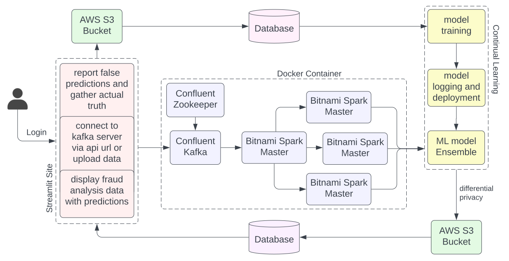

# Project Fraudcatch `alpha`

## Info Edge Ventures AI Hackathon 2024 - Team Scamslayers💀💀✨

### Team Details
- **Team Name:** Scamslayers
- **Team Members:** [Sampriti Mitra](https://github.com/Sampriti03) and [Soumyadeep Bose](https://github.com/soumyadeepbose)

### Problem Statement
Use of AI to predict and prevent financial frauds.

### Project Overview
We have created a production-level fraud detection and prevention system for financial transactions for the InfoEdge Ventures AI Hackathon 2024. Our system is built using a data pipeline, distributed model inference, differential privacy, and continual incremental learning.

### Solution Components
1. **Data Ingestion:**
   - Real-time data streaming using Kafka from the company’s API.
   
2. **Model Inference:**
   - Distributed model inference using Apache Spark to predict fraudulent transactions.
   - Ensemble of several models to increase accuracy.
   
3. **Data Storage:**
   - Storing the data in an S3 bucket upon successful inference using differential privacy.
   
4. **Analysis and Dashboard:**
   - Analyzing stored data and displaying results on a Streamlit dashboard.
   
5. **User Interface:**
   - A Streamlit website for businesses to sign up, connect their API, access fraud data analysis, and receive fraud prevention measures.
   - Real-time notifications for fraudulent transactions.
   
6. **Security and Privacy:**
   - Using differential privacy techniques for data protection and equitable analysis.
   - Reporting false positives to continually train the models.

### Key Features
- **Real-Time Anomaly Detection:** Immediate detection and response to fraudulent activities using Kafka.
- **Distributed Data Processing:** Using Spark for distributed processing and inference.
- **Streamlit Application:** Users can upload data, connect their API, and access an analysis dashboard.
- **Real-Time Notifications:** Email alerts to security teams upon detection of fraud.
- **Scalability and Flexibility:** The system is designed to handle large volumes of data and adapt to various fraud detection needs.
- **Differentially Private Models:** Ensuring user data remains confidential while maintaining high accuracy in fraud detection.

### Technologies Used
- **Data Streaming:** Confluent Kafka, Confluent Zookeeper
- **Data Processing:** Bitnami Spark Master, Bitnami Spark Worker
- **Storage:** AWS S3
- **Machine Learning:** Tensorflow, Pytorch, Scikit-learn, Diffprivlib
- **Web Framework:** Streamlit
- **Programming Languages:** Python
- **Other Tools:** Mlflow, Docker, Pandas, Matplotlib

### Performance Metrics
- **Ensembled Models Accuracy:** 94% accuracy on the test set.
- **Average Spark Processing Delay:** Less than 1 second.
- **Kafka Latency:** 50-80 milliseconds.
- **Data Retrieval Time:** 100 milliseconds per record.

### Future Enhancements
- Implementing homomorphic encryption or secure multi-party computation.
- Integrating blockchain technology for logging transactions and model updates.
- Extending fraud detection capabilities beyond credit card fraud.
- Adding user activity tracking with Google Firebase.
- Deploying the system through AWS ECR for scalability.
- Developing explainability features for real-time fraud detection insights.

### GitHub & Demo Video
- **GitHub Repository:** [fraud-detector](https://github.com/soumyadeepbose/fraud-detector)
- **Demo Video:** [Watch Demo](https://drive.google.com/file/d/1izJ7p9-Au0fZBDVPAhrIiRB8sdAkQ1no/view?usp=sharing)

### Project Architecture

---

This project was developed for the Info Edge Ventures AI Hackathon 2024 by Team Scamslayers.
